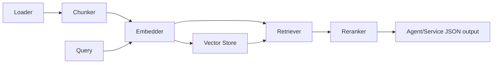

# goragkit

> **The Go-native RAG toolkit for production systems and autonomous agents.**

[](https://go.dev/)
[](LICENSE)
[](.github/workflows/ci.yml)
[](.github/workflows/ci.yml)
[](CHANGELOG.md)

`goragkit` is built for Go teams that need **LangChain/LlamaIndex-level capability** without Python runtime glue.

- ⚡ Fast and memory-efficient primitives.
- 🧠 AI-agent-friendly interfaces and deterministic JSON outputs.
- 🧩 Composable architecture: chunking, embeddings, retrieval, reranking, stores, loaders.
- 🔭 Observability-ready with optional OpenTelemetry tracing.

## Why Go needs this

Go backends increasingly host LLM applications, but many teams still bridge to Python for RAG orchestration. `goragkit` removes that dependency by providing idiomatic, production-grade RAG APIs for microservices, workers, CLI tools, and autonomous agents.

## Installation

```bash
go get github.com/njchilds90/goragkit@v0.2.0
```

## Quickstart (high-level API)

```go
ctx := context.Background()
emb := embedder.NewOpenAI(os.Getenv("OPENAI_API_KEY"), "text-embedding-3-small")
vs := store.NewMemory()

p := goragkit.NewRAGPipeline(emb, vs)

docs := []document.Document{{ID: "doc-1", Text: "Go is excellent for backend RAG services."}}
_ = p.IndexDocuments(ctx, docs)

results, _ := p.Query(ctx, "Why choose Go for RAG?", retrieval.QueryOptions{TopK: 3})
```

## Architecture



## CLI

```bash
goragkit index ./docs --out .goragkit/index.json
goragkit query --index .goragkit/index.json --q "How does caching work?" --topk 5
goragkit serve --index .goragkit/index.json --addr :8080
```

HTTP `serve` request:

```json
{"query":"Explain retrieval pipeline","top_k":5}
```

## Advanced features

- **Vector stores**: in-memory + adapters for Pinecone, Weaviate, pgvector.
- **Embeddings**: OpenAI, Ollama, Cohere + cache wrapper.
- **Retrieval**: vector search + optional BM25 hybrid fusion.
- **Metadata filtering**: first-class query filters.
- **Document loading**: recursive filesystem loader.
- **Observability**: pluggable tracer + OpenTelemetry bridge.
- **Agent ergonomics**: structured errors (`rerrors`) and deterministic command outputs.

## Performance notes

Representative benchmark on `store.Memory` with 5k vectors:

- Query throughput optimized via in-memory cosine scoring and partial-slice sort.
- Use `go test ./... -bench .` to run local benchmarks.

## Example integrations

- gRPC/HTTP services for enterprise knowledge retrieval
- Autonomous coding agents that require stable JSON retrieval responses
- Local desktop tools with offline deterministic embedding via CLI

## Roadmap (post-v0.2.0)

- ANN/HNSW index for ultra-large local corpora
- Multi-vector / ColBERT-style retrieval
- Native streaming ingestion pipelines
- Additional observability exporters

## Contributing

1. Fork and create a feature branch.
2. Add tests and docs for every exported API.
3. Run:
   ```bash
   go test ./... -race
   go test ./... -bench .
   ```
4. Open a PR with benchmark or behavior impact notes.

## Ecosystem integrations

Designed to compose well with Go infra repos such as:

- `go-rules` for policy/guardrails
- `goretry` for robust external API retries
- `gosymbol` for code intelligence pipelines

## License

MIT © njchilds90
